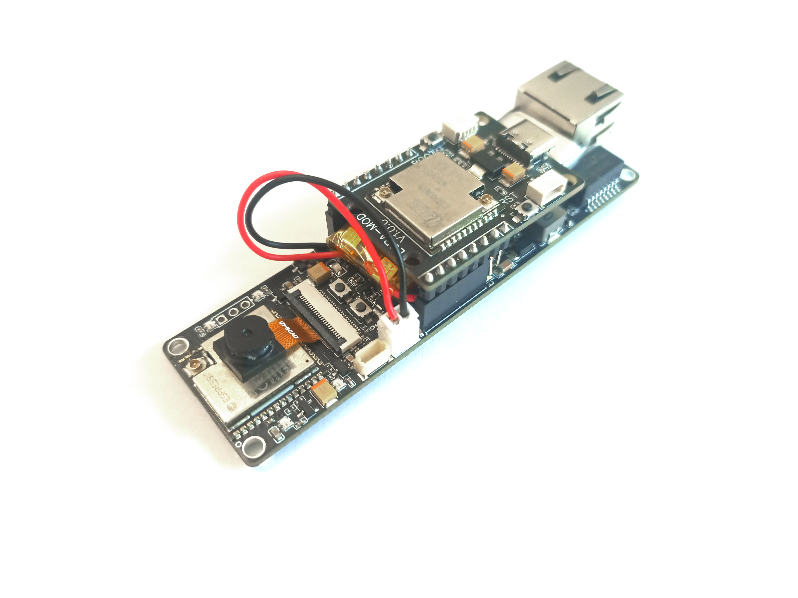
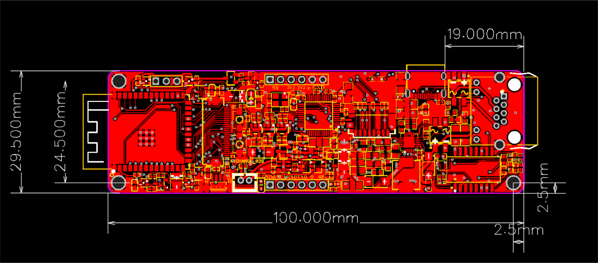

# ai-on-the-edge-cam-hw-description
This repo contains schematics and dimensions for the Ai-On-The-Edge-Cam board. 

More resources:
- [Tindie product](https://www.tindie.com/products/edit/ai-on-the-edge-cam-esp32-s3-with-poe-sd-camera/)
- [Arduino IDE & Platformio examples](https://github.com/allexoK/ai-on-the-edge-device-cam-code-examples)
- [Hackaday project](https://hackaday.io/project/203879-ai-on-the-edge-cam)
- [Ai-On-The-Edge-Device framework](https://github.com/jomjol/AI-on-the-edge-device)
- [Ai-On-The-Edge-Device Wiki](https://jomjol.github.io/AI-on-the-edge-device-docs/)
- [Project discussion with Ai-On-The-Edge-Device developers](https://github.com/jomjol/AI-on-the-edge-device/discussions/2963)
- [ESPHome meter reader](https://github.com/nliaudat/meter-reader)

